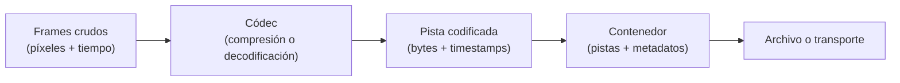

# Capítulo 01: Fundamentos de video

## Propósito

Antes de capturar, decodificar o detectar, conviene nombrar con precisión lo
que recorre el sistema. Un pipeline de video no transporta una abstracción
llamada "video": transporta muestras visuales, tiempo y una representación
elegida para un objetivo concreto.

Este capítulo modela esos conceptos sin abrir una cámara, decodificar un
archivo ni enlazar FFmpeg. La intención es que las decisiones posteriores se
apoyen en contratos verificables y no en nombres de bibliotecas.

## Concepto

Un **frame** es una imagen que representa un instante. La **resolución**
describe cuántos píxeles tiene esa imagen; los **fotogramas por segundo**
(FPS) describen el ritmo esperado de instantes. Un **códec** transforma una
secuencia de frames entre una representación sin comprimir y una codificada.
Un **contenedor** organiza una o más pistas codificadas junto con sus marcas de
tiempo y metadatos.

La dirección inversa existe al reproducir o analizar un stream: el contenedor
entrega una pista, el códec recupera frames y el pipeline decide qué hacer con
cada uno.

## Problema

Confundir estas capas conduce a decisiones costosas. Tratar un archivo `.mp4`
como si fuera un códec impide razonar sobre compatibilidad. Modelar una
operación de detección como si recibiera bytes codificados puede esconder el
costo y la latencia de la decodificación. Asumir que FPS es una garantía de
tiempo real oculta jitter, frames tardíos y pérdida de información.

El curso necesita una base que permita responder preguntas concretas:

- ¿Qué información necesita una etapa que trabaja sobre imágenes?
- ¿Qué costo se paga al conservar pixels sin comprimir?
- ¿En qué capa pertenecen los timestamps?
- ¿Cuándo un formato de archivo es irrelevante para un algoritmo de visión?

## Alternativas de representación

| Representación | Ventaja | Costo | Uso apropiado en este curso |
| --- | --- | --- | --- |
| Frame crudo | Acceso directo a píxeles y geometría | Mucha memoria y ancho de banda | Contratos de análisis, detección y anotación simulada |
| Flujo codificado | Reduce almacenamiento y transferencia | Requiere decodificación y depende del códec | Delimitar la responsabilidad de un adaptador futuro |
| Contenedor | Conserva pistas, orden y metadatos | No entrega píxeles por sí solo | Explicar entrada, salida y compatibilidad sin manipular archivos reales |

No hay una representación universalmente mejor. La elección depende de la
etapa: un detector necesita información equivalente a un frame; un transporte
normalmente prefiere datos codificados; una herramienta de archivo necesita un
contenedor.

## Justificación del primer modelo

El primer modelo del crate representará **metadatos de frame**, no buffers de
píxeles ni archivos reales. Incluirá dimensiones, índice y marca de tiempo
para que los capítulos siguientes puedan probar orden, pérdida, latencia y
anotación de forma determinista.

Esta alternativa permite aprender los tradeoffs importantes sin introducir:

- una dependencia nativa de FFmpeg;
- una cámara o stream con datos privados;
- resultados de rendimiento que aparenten representar producción;
- una API de plataforma como requisito para ejecutar las pruebas.

La integración real con códecs o contenedores se evaluará en el capítulo 04,
con justificación de plataforma y revisión humana antes de agregar una
dependencia no trivial.

## Límites explícitos

- Este capítulo no afirma soporte para H.264, VP9, AV1, MP4, WebM ni otro
  formato concreto.
- FPS se trata como metadato del flujo, no como garantía de entrega puntual.
- La resolución no determina por sí sola el formato de color, tamaño de buffer
  ni calidad visual.
- El modelo posterior no sustituye una biblioteca de codificación o
  decodificación madura.

## Decisión de rendimiento y calidad

**Benchmark: no aplica en este capítulo.** El modelo solo crea y consulta
valores pequeños de metadatos; no mueve buffers, decodifica códecs ni coordina
hilos. Medirlo produciría números sin relación con la latencia de un pipeline
de video y podría inducir conclusiones falsas.

La primera medición será pertinente cuando exista una etapa de pipeline con
trabajo representativo y un presupuesto de latencia explícito, en el capítulo
07. Hasta entonces, la evidencia de calidad de este capítulo es distinta:

- invariantes locales: una resolución nunca admite dimensión cero;
- pruebas deterministas de secuencia, timestamp y resolución;
- ejemplos que compilan sin cámara, códec ni dependencia nativa;
- límites de representación declarados en vez de promesas de rendimiento.

**Property testing: no aplica todavía.** Las invariantes del modelo son pocas y
están cubiertas de manera directa. Si los capítulos de tracking o pipeline
introducen secuencias generadas y reglas temporales, se reconsiderará una
dependencia de property testing con su justificación correspondiente.

## Siguiente paso

La siguiente subtarea define los tipos Rust y las pruebas que expresan estos
metadatos. El objetivo no será procesar video, sino fijar un contrato pequeño
del que las etapas posteriores puedan depender.
