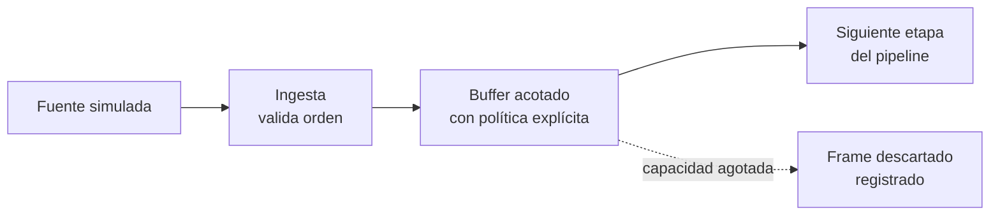

# Capítulo 02: Captura e ingesta de streams

## Propósito

La ingesta recibe una secuencia de frames desde una fuente y la entrega a la
primera etapa del pipeline. No es un reproductor: no decide cómo dibujar la
imagen, sincronizar audio ni elegir la interfaz de una persona usuaria.

En este curso, una fuente es simulada y determinista. Así se puede estudiar el
tiempo, la pérdida y los límites de buffer sin acceder a cámaras, streams
privados ni protocolos reales.

## Concepto

Cada frame tiene una **secuencia** y un **timestamp**. La secuencia permite
detectar huecos u orden incorrecto; el timestamp permite razonar sobre el
tiempo que el pipeline consume. Un buffer conserva temporalmente frames cuando
la entrada y la siguiente etapa no avanzan al mismo ritmo.

La captura o el transporte de bytes pertenecen al conocimiento canónico de
`rust-networking`. Este capítulo usa el resultado de esa capa: eventos de
frame con metadatos suficientes para que el pipeline tome decisiones visibles.

## Problema

Una fuente real no entrega siempre a una cadencia ideal. Un frame puede llegar
tarde, repetido, fuera de orden o cuando el consumidor aún procesa uno
anterior. Si el sistema acumula todo sin límite, la latencia crece hasta que el
resultado deja de representar el presente. Si descarta sin declararlo, oculta
un tradeoff de calidad y continuidad.

## Alternativas

| Estrategia | Ventaja | Riesgo | Cuándo usarla |
| --- | --- | --- | --- |
| Buffer ilimitado | Evita pérdida inmediata | Latencia y memoria sin cota | No corresponde a un flujo en tiempo real |
| Bloquear la fuente | Conserva todos los frames | Propaga presión y puede detener la captura | Cuando la fuente admite control de flujo |
| Descartar el más reciente | Conserva continuidad histórica | El resultado se atrasa | Análisis por lotes, no visualización actual |
| Descartar el más antiguo | Favorece el estado actual | Pierde continuidad temporal | Primer modelo de tiempo real de este curso |

## Justificación del modelo

El primer contrato de ingesta tendrá una capacidad fija y una política de
**descartar el frame más antiguo** cuando llegue uno nuevo y el buffer esté
lleno. La operación devolverá de forma explícita el frame descartado; no se
silencia la pérdida.

Con ello se puede probar que:

- el buffer conserva el trabajo más reciente;
- la pérdida tiene evidencia verificable;
- la capacidad limita memoria y latencia acumulada;
- la etapa posterior recibe frames en orden de salida del buffer.

## Ingesta y reproducción son distintos

La ingesta responde: "¿qué frame se acepta, se conserva o se descarta?". La
reproducción responde: "¿cuándo y cómo se presenta ese frame?". Mezclarlas
obliga a una etapa de infraestructura a conocer relojes de interfaz, pantallas
o audio, y hace más difícil medir las decisiones del pipeline.

## Límites explícitos

- No se abre una cámara ni socket.
- No se implementa RTSP, WebRTC, HLS, RTP ni otro protocolo.
- Los timestamps se tratan como datos ya obtenidos por la fuente.
- La política elegida no es una recomendación universal: la pérdida correcta
  depende del dominio y se debe justificar por etapa.

## Siguiente paso

La siguiente subtarea implementa un buffer acotado sobre los metadatos del
capítulo 01 y pruebas que demuestran su política de pérdida.
