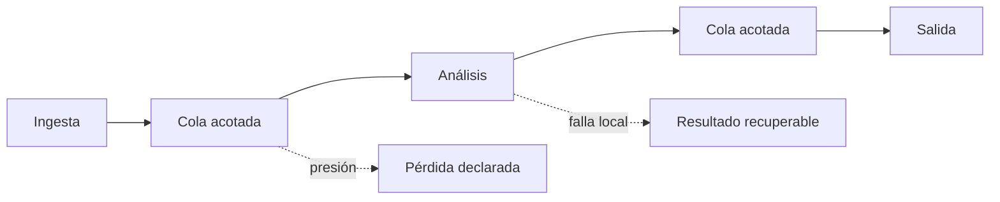

# Capítulo 03: Pipeline de procesamiento en tiempo real

## Propósito

Un pipeline divide trabajo en etapas con contratos claros. La fuente entrega
frames, una etapa los transforma o analiza, y otra publica un resultado. El
valor no está en dibujar cajas y flechas: está en hacer explícitos el orden, la
presión, la cancelación y la recuperación cuando una etapa falla.

## Concepto

Cada etapa recibe una entrada y devuelve una de tres decisiones: producir una
salida, descartar trabajo de manera justificada o informar una falla local.
La **backpressure** aparece cuando una etapa produce más rápido de lo que la
siguiente puede consumir. Un pipeline sano no la oculta en una cola ilimitada.

## Problema

Cuando todas las responsabilidades viven en una función, resulta difícil saber
qué trabajo se acumuló, qué frame causó un error o dónde se introdujo latencia.
Agregar hilos sin contratos empeora el problema: las carreras, el cierre y la
propagación de errores se vuelven incidentales.

## Alternativas

| Diseño | Ventaja | Costo | Decisión pedagógica |
| --- | --- | --- | --- |
| Secuencial | Determinista y fácil de depurar | No solapa trabajo | Punto de partida para contratos y pruebas |
| Por lotes | Puede mejorar throughput | Aumenta espera por grupo | Útil cuando el dominio tolera retraso |
| Etapas concurrentes | Solapa trabajo independiente | Exige propiedad, cierre y backpressure | Se introduce después del modelo secuencial |

## Justificación del primer pipeline

El primer pipeline es **secuencial y determinista**. Sus etapas se expresan
como un trait que recibe un frame y puede devolver una salida, una falla local
recuperable o una señal de cancelación. Esta opción deja visibles los contratos
sin mezclar todavía canales, tareas asíncronas ni dependencias de concurrencia.

Después, el capítulo 08 retomará los mismos contratos para discutir propiedad
de buffers y paralelismo seguro. El curso evita presentar la concurrencia como
un remedio automático para la latencia.

## Límites explícitos

- No se crea un runtime asíncrono ni hilos en este capítulo.
- No se promete una tasa de frames ni latencia de producción.
- La recuperación cubre fallas locales modeladas, no reinicios de procesos o
  infraestructura externa.
- La política de pérdida sigue perteneciendo a la ingesta; el pipeline no la
  borra ni la convierte en éxito.

## Decisión de rendimiento y calidad

**Benchmark: no aplica todavía.** Este capítulo ejecuta una etapa secuencial
sobre metadatos pequeños. Un número obtenido aquí mediría el código de control
del ejemplo, no decodificación, análisis, buffers de píxeles ni presión entre
etapas reales. El curso no presentará ese resultado como rendimiento de video.

La evidencia vigente es semántica: el reporte conserva orden, contabiliza
falla local y diferencia cancelación de descarte. Cuando el capítulo 07 defina
un presupuesto por etapa, podrá medir una carga representativa y documentar
qué factores siguen fuera del experimento.

**Property testing: no aplica aún.** La cobertura de escenarios concretos
protege las reglas actuales. Si se agregan combinaciones generadas de etapas,
fallas y cancelación, se evaluará esa dependencia con una justificación escrita.

## Siguiente paso

La siguiente subtarea implementa los contratos de etapa y pruebas para orden,
cancelación y recuperación de una falla local.
