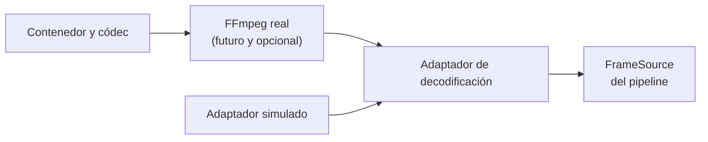

# Capítulo 04: Decodificación y FFmpeg desde Rust

## Propósito

FFmpeg resuelve problemas maduros: demuxing, códecs, negociación de formatos y
conversión. El valor de Rust Video no está en reimplementarlos, sino en diseñar
el límite que permite al pipeline recibir frames sin quedar acoplado a una
instalación, sistema operativo o versión concreta de esa herramienta.

## Concepto

Un adaptador traduce una dependencia externa al contrato que consume el
dominio. Para este curso, el dominio pide “el siguiente frame disponible o un
error explícito”; no necesita conocer una API C, un puntero nativo ni un
contenedor específico.

## Problema

Enlazar FFmpeg desde el primer commit desplaza la atención hacia instalación,
linking, licencias de distribución y diferencias de plataforma. También hace
que pruebas básicas dependan de binarios locales. Es un costo legítimo cuando
se necesita decodificar video real; no lo es para explicar contratos de
ingesta, pipeline y salida.

## Alternativas

| Alternativa | Ventaja | Riesgo |
| --- | --- | --- |
| Usar FFmpeg directamente en el dominio | Menos capas iniciales | Acopla el curso a detalles nativos |
| Crear un adaptador simulable | Pruebas reproducibles y límite claro | No decodifica video real |
| Reimplementar decodificación | Control aparente | Alcance inviable y errores de seguridad |

## Justificación

El curso define un trait de decodificador y un adaptador simulado. El simulador
entrega metadatos de frames predefinidos y puede informar fallas de apertura o
lectura. Esa interfaz es suficiente para demostrar cómo el pipeline recibe
resultados de una dependencia externa sin afirmar compatibilidad con un códec.

La integración real se evaluará solo con una decisión humana sobre crates,
licencia, plataformas objetivo, binarios de CI y estrategia de pruebas. No se
agrega FFmpeg ni una binding nativa en este draft.

## Límites y riesgos de plataforma

- FFmpeg es una herramienta externa; su disponibilidad no es uniforme.
- Un wrapper de Rust puede requerir bibliotecas de sistema y headers.
- La licencia del binario y de los códecs debe revisarse para cada forma de
  distribución.
- Un error de decodificación no autoriza el uso de `unsafe` en el dominio.
- Este capítulo no declara soporte para ningún códec, contenedor o plataforma.

## Siguiente paso

La siguiente subtarea crea un contrato de decodificador y un simulador con
pruebas, sin dependencias nativas.
