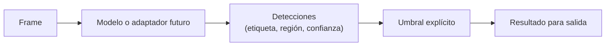

# Capítulo 05: Detección de objetos sobre frames

## Propósito

Una etapa de detección convierte un frame en afirmaciones con incertidumbre.
No ve objetos con certeza: entrega etiquetas, regiones y niveles de confianza
que otro componente debe interpretar con límites explícitos.

## Concepto

Una detección contiene una etiqueta, una región y una confianza normalizada.
Un umbral convierte esa confianza en una decisión de producto: conservar una
detección puede reducir falsos negativos, pero también aumentar falsos
positivos.

## Problema

Ocultar el umbral tras una API hace que un valor aparentemente técnico defina
una experiencia sin discusión. Además, una detección incompleta o equivocada
puede influir en decisiones humanas. El curso no debe insinuar precisión,
vigilancia o evaluación responsable sin datos legítimos y evidencia.

## Alternativas

| Alternativa | Ventaja | Riesgo |
| --- | --- | --- |
| Aceptar toda detección | Más cobertura aparente | Ruido y falsos positivos |
| Umbral fijo | Reproducible y simple | Puede no servir a todos los contextos |
| Umbral adaptativo | Puede responder al dominio | Requiere datos y evaluación adicional |

## Justificación del modelo

El primer modelo no incorpora una red neuronal ni un runtime de inferencia.
Representa resultados sintéticos y aplica un umbral explícito. Esto permite
probar decisiones y salida sin afirmar que un modelo funciona sobre personas,
rostros, cámaras o contenido privado.

## Privacidad y límites

- No se procesan imágenes reales, rostros ni datos biométricos.
- Una etiqueta sintética no prueba precisión, equidad ni utilidad.
- La evaluación pertenece al conocimiento canónico de `rust-ai-engineering`.
- Cualquier modelo, dataset o inferencia real exige autorización humana,
  procedencia legítima y una política de privacidad específica.

## Siguiente paso

La siguiente subtarea añade tipos deterministas de región y detección, con
umbrales verificables y sin dependencia de un modelo.
