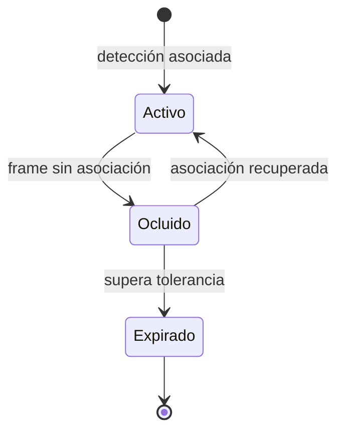

# Capítulo 06: Seguimiento entre frames

## Propósito

Detectar un objeto en un frame y seguirlo a través del tiempo son problemas
distintos. La detección responde qué parece estar presente; el tracking decide
si dos observaciones pertenecen a una misma identidad temporal.

## Concepto

Un track tiene un identificador, el último frame observado y un estado. Al no
recibir una detección compatible, el track puede estar ocluido, haber salido de
escena o corresponder a una asociación incorrecta. Esa incertidumbre debe ser
parte del modelo.

## Problema

Asignar una identidad nueva para cada detección rompe la continuidad. Conservar
una identidad para siempre es igual de peligroso: puede asociar a objetos
distintos después de una pausa. El criterio de expiración y reasignación no es
un detalle de implementación, sino una decisión de producto y de riesgo.

## Alternativas

| Estrategia | Ventaja | Riesgo |
| --- | --- | --- |
| Detecciones independientes | Simple y sin estado | No conserva identidad temporal |
| Track persistente sin expiración | Continuidad aparente | Asociaciones obsoletas o incorrectas |
| Track con oclusión y expiración | Estado y límites visibles | Requiere reglas claras de asociación |

## Justificación del modelo

El primer modelo asigna un `TrackId` de forma determinista, registra el último
frame y permite una cantidad finita de frames sin observación antes de expirar.
No calcula similitud visual ni usa rasgos biométricos. Las asociaciones llegan
como una decisión sintética para poder probar oclusión, expiración y
reasignación sin una cámara ni un modelo.

## Límites explícitos

- No se usan rostros, embeddings ni identificación de personas.
- Una asociación sintética no demuestra robustez visual.
- La tolerancia de oclusión no es una recomendación universal.
- Reasignar una identidad expirada debe ser visible en el contrato.

## Decisión de rendimiento y validación

**Benchmark: no aplica.** El track actual actualiza unos cuantos metadatos y
no realiza asociación visual. Medirlo no representa el costo de un algoritmo de
tracking real ni de una fuente de video.

**Property testing: no aplica todavía.** Las transiciones de estado y la
frontera de expiración se cubren con casos deterministas. Si el curso introduce
un registro de muchos tracks, secuencias generadas de oclusión y reglas de
asociación, se reconsiderará la dependencia con una justificación escrita.

## Siguiente paso

La siguiente subtarea implementa tracks con expiración determinista y pruebas
para oclusión y reasignación explícita.
