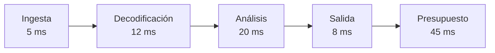

# Capítulo 07: Rendimiento y presupuesto de latencia

## Propósito

Rendimiento no es una cifra aislada. Un sistema de video necesita saber cuánto
tiempo puede consumir cada etapa, qué ocurre al superar ese presupuesto y qué
calidad se sacrifica al reducir espera o trabajo.

## Concepto

La latencia extremo a extremo es la suma del tiempo en cada etapa y de las
esperas entre ellas. El throughput describe cuántas unidades se completan por
unidad de tiempo. Ninguna métrica sustituye a la otra: un sistema puede tener
alto throughput y entregar resultados demasiado tarde.

## Problema

Optimizar una función sin un presupuesto puede mejorar un detalle irrelevante.
También puede ocultar que el buffer añade más espera que el análisis, o que
descartar frames reduce latencia a costa de continuidad. Sin registrar el
entorno, una medición local termina pareciendo una afirmación de producción.

## Alternativas

| Enfoque | Ventaja | Riesgo |
| --- | --- | --- |
| Medir solo throughput | Fácil de comunicar | Oculta resultados tardíos |
| Medir solo latencia total | Cercano a experiencia | No localiza el cuello de botella |
| Presupuesto por etapa | Hace tradeoffs explícitos | Requiere mantener contratos |

## Justificación del modelo

El curso usa un `LatencyBudget` con duraciones por etapa y una suma verificable.
La medición local usa `Instant` sobre el pipeline determinista, sin publicar un
número fijo ni compararlo con producción. El resultado se interpreta como una
señal de regresión local, no como capacidad de FFmpeg, una cámara, una GPU o
un modelo de IA.

## Límites de medición

- No representa decodificación real, I/O, red, carga de CPU ni GPU.
- No sirve para comparar máquinas, sistemas operativos o compiladores.
- No fija una meta artificial de milisegundos para el proyecto.
- La calidad de salida sigue siendo una decisión: menor latencia puede implicar
  pérdida de frames, menos análisis o resultados incompletos.

## Decisión de rendimiento y validación

**Medición local: aplica.** El ejemplo usa `Instant` para repetir la
construcción y comprobación del presupuesto en una misma máquina. Es una señal
local de regresión del modelo, no una comparación entre equipos ni un perfil de
una integración real.

**Suite de benchmarks: no aplica todavía.** No se agrega `criterion` porque el
crate no ejecuta códecs, I/O, modelos ni procesamiento de píxeles. Una cifra de
esa suite aparentaría precisión sobre un sistema que aún no existe. Si un
capítulo posterior introduce un contrato de rendimiento repetible y relevante,
la dependencia se evaluará con su justificación escrita.

**Property testing: no aplica todavía.** Las reglas son suma de duraciones,
límite positivo y nombres de etapa no vacíos; los casos deterministas cubren
sus fronteras de forma legible. Si se incorporan planificadores, colas o
secuencias amplias de políticas de backpressure, se reconsiderará.

## Siguiente paso

La siguiente subtarea modela presupuestos positivos y pruebas de suma antes de
ejecutar la medición local reproducible.
