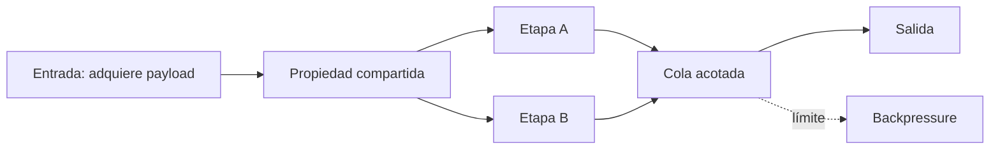

# Capítulo 08: Paralelismo y zero-copy

## Propósito

Procesar más de un frame o más de una etapa a la vez puede reducir espera, pero
también vuelve visible la propiedad de los datos, el orden, la presión de las
colas y el costo de coordinar trabajo. Zero-copy no significa ausencia total de
asignaciones: significa evitar copias innecesarias después de decidir quién es
dueño de un buffer.

## Concepto

Un payload compartido puede tener una sola propiedad y varios lectores. Rust
expresa esta decisión con tipos seguros; una cola acotada representa cuánto
trabajo se permite en vuelo antes de aplicar backpressure.

## Problema

Copiar bytes para cada etapa consume memoria y tiempo; compartir sin un límite
puede dejar que la cola crezca hasta aumentar más la latencia que el trabajo
que pretendía acelerar. Introducir punteros manuales para evitar una copia
puede romper la seguridad de memoria y alejar el curso de su objetivo
pedagógico.

## Alternativas

| Enfoque | Ventaja | Riesgo |
| --- | --- | --- |
| Copiar el payload por etapa | Propiedad muy simple | Costo acumulado de memoria y copia |
| Compartir con `Arc` y cola acotada | Lectura compartida con límites visibles | Coordinación y vida útil más explícitas |
| `unsafe` y buffers manuales | Control máximo | Invariantes frágiles sin necesidad actual |

## Justificación del modelo

El capítulo representa bytes compartidos con `Arc<[u8]>`, un plan de trabajo
con número positivo de workers y máximo de elementos en vuelo. La primera
conversión al payload compartido puede asignar o copiar según la fuente; el
ahorro que se enseña empieza al clonar referencias para etapas posteriores. Un
canal acotado de la biblioteca estándar ilustra backpressure sin requerir un
runtime asíncrono ni una biblioteca de concurrencia.

## Límites explícitos

- No hay paralelismo de GPU, SIMD, pinning de CPU ni afinidad de hilos.
- No se afirma que `Arc` sea más rápido para todos los tamaños de payload.
- No se usan punteros, FFI ni `unsafe` para perseguir zero-copy.
- La fuente de video real y su propiedad de buffers siguen fuera de alcance.

## Decisión de rendimiento y validación

**Benchmark: no aplica todavía.** Cronometrar una clonación de `Arc` o un canal
aislado no demostraría rendimiento de un pipeline de video. El costo útil
depende de tamaño, memoria, contención, trabajo de cada etapa y entorno. El
capítulo conserva ejemplos ejecutables y la medición local del capítulo 07;
no agrega `criterion` sin una pregunta de rendimiento concreta.

**Property testing: no aplica todavía.** Los contratos actuales tienen pocas
fronteras claras: límites positivos, capacidad en vuelo y almacenamiento
compartido. Las pruebas deterministas muestran esas reglas directamente. Si se
añade un planificador con políticas de descarte, reintento o reparto por
workers, se reconsiderarán secuencias generadas junto con la justificación de
la dependencia.

**Seguridad: aplica por diseño.** El módulo mantiene `unsafe` prohibido en el
crate y usa `Arc` y canales de la biblioteca estándar. Zero-copy no es razón
suficiente para abandonar esos límites.

## Conexiones canónicas

- El límite de trabajo en vuelo conecta con backpressure y concurrencia.
- La propiedad compartida conecta con ownership, préstamos y coste de copias.
- La medición responsable retoma el presupuesto de latencia del capítulo 07.

## Siguiente paso

La siguiente subtarea modela el payload compartido y los límites de un plan de
procesamiento con pruebas deterministas.
