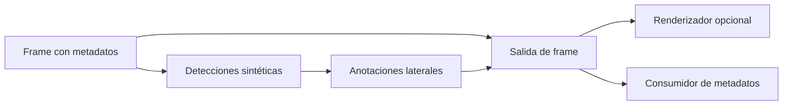

# Capítulo 09: Salida y anotación del stream

## Propósito

Una detección no es todavía una salida útil. El pipeline debe decidir cómo
representa anotaciones, cómo las relaciona con el frame y qué información
conserva o expone. Esa decisión afecta depuración, privacidad y futuras
integraciones de renderizado.

## Concepto

Una anotación lateral asocia etiqueta, región y confianza con los metadatos del
frame, sin editar sus píxeles. El consumidor puede renderizarla, registrarla o
ignorarla según su propio contrato.

## Problema

Dibujar directamente sobre los píxeles mezcla análisis y presentación; después
puede ser imposible recuperar el frame original o saber qué decisión produjo
una marca. Guardar todo sin criterio también puede aumentar superficie de
privacidad, en especial si la fuente fuera sensible.

## Alternativas

| Estrategia | Ventaja | Riesgo |
| --- | --- | --- |
| Anotación destructiva sobre píxeles | Vista inmediata | Pierde el original y mezcla responsabilidades |
| Metadatos laterales | Trazabilidad y consumidores independientes | Requiere un paso de renderizado separado |
| Persistir video y anotaciones | Facilita revisión posterior | Mayor costo y superficie de privacidad |

## Justificación del modelo

El curso modela una salida determinista como `FrameOutput`: metadatos de un
frame más anotaciones laterales derivadas de detecciones ya aceptadas. No
modifica bytes de imagen, no escribe archivos y no envía resultados fuera del
proceso. Así se puede demostrar el recorrido completo sin afirmar que existe
un renderer, grabador o stream de producción.

## Privacidad y límites explícitos

- No se reciben cámaras, streams privados, rostros ni audio real.
- Las etiquetas del ejemplo son sintéticas y no identifican personas.
- No se persisten frames, payloads ni anotaciones.
- Un renderizador futuro debe justificar qué datos muestra, guarda y comparte.

## Decisión de rendimiento y validación

**Benchmark: no aplica todavía.** El modelo solo crea estructuras de
metadatos; no hay renderer, códec, I/O ni almacenamiento que medir. Un
benchmark de `Vec` y `String` no respondería una pregunta útil para un sistema
de video ni justificaría agregar `criterion`.

**Property testing: no aplica todavía.** La relación entre detección y
anotación, y el orden de inserción, se verifican con ejemplos deterministas.
Si un capítulo futuro incorpora composición de overlays, serialización o
políticas de redacción de datos, se reconsiderarán propiedades generadas con
una justificación explícita.

**Privacidad: aplica por límite de alcance.** La demostración no toma, guarda
ni transmite medios. Un consumidor futuro no debe interpretar este modelo como
autorización para tratar datos de personas o streams privados.

## Siguiente paso

La siguiente subtarea implementa anotaciones laterales y una salida de frame
con pruebas de orden y conservación de metadatos.
